# Modelo de entidades — Persi Database V1

## Convenções

- PK: `uuid`, gerado pelo banco; timestamps `timestamptz` em UTC.
- Dinheiro: `bigint` em minor units e `currency char(3)`.
- IDs humanos (`order_number`, código de cupom) e externos não são PK.
- Soft delete somente em entidades editoriais que precisam preservar referência;
  transações são canceladas/anonimizadas, não apagadas cegamente.
- Status são tipos/checks controlados; mudanças entram em migrations.
- FK de histórico usa `ON DELETE RESTRICT` ou `SET NULL` mais snapshot; tabelas
  de composição descartáveis podem usar `CASCADE`.

## Diagrama ER principal

```mermaid
erDiagram
  BRANDS ||--o{ PRODUCTS : owns
  CATEGORIES ||--o{ CATEGORIES : parent
  PRODUCTS ||--|{ PRODUCT_VARIANTS : sells_as
  PRODUCTS ||--o{ PRODUCT_CATEGORIES : classified
  CATEGORIES ||--o{ PRODUCT_CATEGORIES : contains
  PRODUCTS ||--o{ PRODUCT_MEDIA : presents
  MEDIA_ASSETS ||--o{ PRODUCT_MEDIA : used_by

  ATTRIBUTES ||--o{ ATTRIBUTE_VALUES : offers
  UNITS ||--o{ ATTRIBUTE_VALUES : measures
  PRODUCTS ||--o{ PRODUCT_ATTRIBUTE_VALUES : describes
  PRODUCT_VARIANTS ||--o{ VARIANT_ATTRIBUTE_VALUES : differentiates
  ATTRIBUTE_VALUES ||--o{ PRODUCT_ATTRIBUTE_VALUES : assigned
  ATTRIBUTE_VALUES ||--o{ VARIANT_ATTRIBUTE_VALUES : assigned
  ATTRIBUTE_VALUES ||--o{ MEASUREMENT_COMPONENTS : decomposes
  UNITS ||--o{ MEASUREMENT_COMPONENTS : units

  PRICE_LISTS ||--o{ PRICES : contains
  PRODUCT_VARIANTS ||--o{ PRICES : priced
  PRICES ||--o{ PRICE_HISTORY : changes

  INVENTORY_LOCATIONS ||--o{ INVENTORY_LEVELS : holds
  PRODUCT_VARIANTS ||--o{ INVENTORY_LEVELS : stocked
  INVENTORY_LEVELS ||--o{ INVENTORY_MOVEMENTS : ledger
  INVENTORY_LEVELS ||--o{ INVENTORY_RESERVATIONS : reserves

  CUSTOMERS ||--o{ CUSTOMER_ADDRESSES : owns
  PRINCIPALS o|--o| CUSTOMERS : represents
  PRINCIPALS ||--o{ PRINCIPAL_ROLES : receives
  ROLES ||--o{ PRINCIPAL_ROLES : grants
  ROLES ||--o{ ROLE_PERMISSIONS : contains
  PERMISSIONS ||--o{ ROLE_PERMISSIONS : allows
  CUSTOMERS o|--o{ CARTS : uses
  CARTS ||--o{ CART_ITEMS : contains
  PRODUCT_VARIANTS ||--o{ CART_ITEMS : selected

  CUSTOMERS o|--o{ ORDERS : places
  ORDERS ||--|{ ORDER_ITEMS : snapshots
  ORDERS ||--|{ ORDER_ADDRESSES : snapshots
  ORDERS ||--o{ ORDER_STATUS_HISTORY : transitions
  PRODUCT_VARIANTS o|--o{ ORDER_ITEMS : originated
  ORDERS ||--o{ PAYMENTS : paid_by
  PAYMENTS ||--o{ PAYMENT_TRANSACTIONS : records
  ORDERS ||--o{ SHIPMENTS : fulfilled_by
  SHIPMENTS ||--o{ SHIPMENT_EVENTS : tracks

  PROMOTIONS ||--o{ COUPONS : exposes
  PROMOTIONS ||--o{ PROMOTION_TARGETS : scopes
  COUPONS ||--o{ COUPON_REDEMPTIONS : redeemed
  ORDERS ||--o{ COUPON_REDEMPTIONS : consumes

  INTEGRATION_JOBS ||--o{ INTEGRATION_ERRORS : reports
  WEBHOOK_EVENTS o|--o{ INTEGRATION_JOBS : triggers
  IDEMPOTENCY_KEYS o|--o| ORDERS : protects
  OUTBOX_EVENTS o|--o{ INTEGRATION_JOBS : dispatches
```

SEO metadata, redirects, external mappings and audit logs intentionally use
controlled logical references so they can cover several domains without adding
one nullable FK per entity. The application validates `entity_type`; migrations
may add triggers if tests show the tradeoff is justified.

## Catálogo de entidades

Growth: low (<100k), medium (100k–10M) or high (>10M over platform lifetime).

| Entity | Purpose | PK | Important FKs | Important unique constraints | Sensitive? | Growth |
| --- | --- | --- | --- | --- | --- | --- |
| `brands` | Marca navegável | uuid | — | `slug`; normalized name | no | low |
| `categories` | Árvore simples adjacency-list | uuid | `parent_id -> categories` | `(parent_id, slug)` plus root partial unique | no | low |
| `products` | Conceito comercial | uuid | `brand_id`, optional primary category | `slug` | no | medium |
| `product_variants` | Unidade vendável | uuid | `product_id` | normalized `sku`; partial normalized GTIN | no | medium |
| `product_categories` | Produto N:N categoria | composite | product, category | `(product_id, category_id)` | no | medium |
| `media_assets` | Referência de imagem/vídeo/documento | uuid | — | optional `(provider, path)` | no | medium |
| `product_media` | Uso e ordem da mídia | uuid | product, optional variant, media | `(product_id, variant_id, media_id, role)` | no | medium |
| `units` | Unidade controlada e fator futuro | uuid | optional base unit | `code` | no | low |
| `attributes` | Definição tipada e flags PIM | uuid | optional unit family | `code` | no | low |
| `attribute_values` | Valor canônico/display | uuid | attribute, optional unit | uniqueness by typed normalized value within attribute | no | medium |
| `measurement_components` | Partes ordenadas de medida composta | uuid | attribute_value, unit | `(attribute_value_id, position)` | no | medium |
| `product_attribute_values` | Atributo do produto | uuid | product, attribute, value | `(product_id, attribute_id, attribute_value_id)` | no | medium |
| `variant_attribute_values` | Atributo/variação da variant | uuid | variant, attribute, value | `(variant_id, attribute_id)` for variation-defining; otherwise value tuple | no | medium |
| `price_lists` | Canal/moeda/região de preços | uuid | — | `code` | no | low |
| `prices` | Preço vigente/agendado da variant | uuid | variant, price list | no overlapping effective interval per business key | no | medium |
| `price_history` | Auditoria econômica de mudanças | uuid | price | idempotent source event when available | internal | high |
| `inventory_locations` | Loja/depósito | uuid | — | `code` | internal | low |
| `inventory_levels` | Saldo por variant/local | uuid | variant, location | `(variant_id, location_id)` | internal | medium |
| `inventory_movements` | Razão append-only de estoque | uuid | inventory level, optional reservation | `(source_system, source_reference, movement_type)` when reference exists | internal | high |
| `inventory_reservations` | Hold temporário | uuid | inventory level, optional cart/order | unique active business reference; reservation token | internal | high |
| `customers` | Perfil comercial mínimo | uuid | optional identity principal | normalized email; partial document hash | yes | medium |
| `customer_addresses` | Endereço reutilizável | uuid | customer | no forced uniqueness; optional client key | yes | medium |
| `principals` | Identidade interna que mapeia auth atual/futura | uuid | optional customer | `(provider, external_subject_hash)` | yes | medium |
| `roles` | Papel administrativo controlado | uuid | — | `code` | internal | low |
| `permissions` | Capacidade granular | uuid | — | `code` | internal | low |
| `principal_roles` | Atribuição de papel com escopo | uuid | principal, role | active tuple by principal/role/scope | restricted | low |
| `role_permissions` | Composição de papel | composite | role, permission | `(role_id, permission_id)` | internal | low |
| `carts` | Intenção autenticada ou guest | uuid | optional customer | partial active guest token hash; at most one selected active cart policy | yes | high |
| `cart_items` | Quantidade de uma variant | uuid | cart, variant | `(cart_id, variant_id, configuration_hash)` | yes | high |
| `orders` | Venda histórica | uuid | optional customer | `order_number` | yes | high |
| `order_items` | Snapshot do item vendido | uuid | order, nullable product/variant | `(order_id, line_number)` | yes | high |
| `order_addresses` | Snapshot billing/shipping | uuid | order | `(order_id, address_type)` | yes | high |
| `order_status_history` | Transições dos três eixos | uuid | order | optional idempotency/source event | internal | high |
| `payments` | Intenção agregada provider-neutral | uuid | order | optional `(provider, external_reference)` partial unique | yes | high |
| `payment_transactions` | Autorizações/capturas/refunds | uuid | payment | `(provider, external_reference, transaction_type)` | yes | high |
| `idempotency_keys` | Resultado estável de comandos | uuid | logical resource | `(scope, key)` | internal | high |
| `webhook_events` | Inbox de providers | uuid | optional processed job | `(provider, external_event_id)` when reliable; fallback payload hash window | restricted | high |
| `outbox_events` | Eventos atômicos a publicar | uuid | logical aggregate | optional `(aggregate_type, aggregate_id, event_key)` | internal | high |
| `shipping_methods` | Método/provider configurado | uuid | — | `(provider, external_code)` | no | low |
| `shipments` | Snapshot e execução de remessa | uuid | order, shipping method | optional tracking/provider reference | yes | medium |
| `shipment_events` | Timeline do transporte | uuid | shipment | provider event id when present | internal | high |
| `promotions` | Regra promocional limitada V1 | uuid | — | `code` | internal | low |
| `promotion_targets` | Escopo explícito product/category/brand | uuid | promotion + logical target | `(promotion_id, target_type, target_id)` | internal | medium |
| `coupons` | Código resgatável | uuid | promotion | normalized `code` | internal | medium |
| `coupon_redemptions` | Consumo e limite | uuid | coupon, order, customer | `(coupon_id, order_id)` | yes | high |
| `seo_metadata` | Metadata por entidade/locale | uuid | logical entity | `(entity_type, entity_id, locale)` | no | medium |
| `redirects` | Preservação de URL | uuid | — | normalized `source_path` | no | low |
| `search_synonyms` | Termo -> canônico | uuid | — | normalized `(term, canonical_term)` | no | low |
| `external_mappings` | Identidade cross-system | uuid | logical internal entity | `(system, entity_type, external_id)` and internal mapping scope | internal | medium |
| `integration_jobs` | Trabalho retry-safe | uuid | optional webhook/outbox | idempotency/dedup key | internal | high |
| `integration_errors` | Falhas sanitizadas | uuid | job | — | restricted | high |
| `audit_logs` | Trilha administrativa append-only | uuid | actor/logical entity | optional correlation/event ID | restricted | high |

## Colunas e constraints essenciais

### Catalog/PIM

- `products.status`: `draft|active|inactive|archived`; `published_at` obrigatório
  quando ativo/publicado. `deleted_at` apenas para arquivamento editorial.
- `product_variants.sku_normalized NOT NULL UNIQUE`; SKU original preservado.
- `gtin_normalized` nullable, somente dígitos e comprimento/check digit validado
  na aplicação/import staging. Índice único parcial `WHERE gtin_normalized IS NOT
  NULL`; conflitos legítimos de legado ficam em staging, não são promovidos.
- Dimensões/peso físicos são `numeric` exato com unidade explícita; não são money.
- Flags de atributo: commercial, technical, variation, filterable, searchable e
  visible. Um check garante ao menos o tipo de valor correto.

### Money/pricing

- Todos os campos monetários são `bigint`; moeda `char(3)` inicialmente `BRL`.
- `amount_minor >= 0`; desconto e refund não excedem a base correspondente.
- `prices`: `list_amount_minor`, optional `sale_amount_minor`, e check
  `sale <= list`; intervalos `[valid_from, valid_to)`.
- `price_history` é append-only e registra before/after, origem e actor sem
  duplicar cada leitura. Só grava mudança efetiva.

Escolha de `bigint` sobre `numeric(p,s)`: todos os providers atuais operam BRL
com duas casas e o front já usa minor units. Inteiros eliminam arredondamento e
facilitam igualdade/idempotência. Conversão de APIs acontece na borda. Uma nova
moeda com minor unit diferente usa metadata ISO e ainda armazena minor units.

### Inventory

- Quantidades V1 são `bigint` inteiras por unidade vendável; fracionamento exige
  decisão comercial futura e não será simulado com float.
- `on_hand >= 0`, `reserved >= 0`, `reserved <= on_hand`.
- `available` é coluna gerada ou expressão consultada:
  `on_hand - reserved`; nunca é escrita independentemente.
- Movimento tem delta assinado não zero, before/after, tipo, source e referência.
- Reserva ativa tem `quantity > 0` e `expires_at > created_at`.

Concorrência recomendada: transação curta faz `SELECT ... FOR UPDATE` do level em
ordem determinística e/ou `UPDATE ... SET reserved = reserved + :q WHERE
on_hand - reserved >= :q RETURNING ...`. O update condicional é a garantia de
capacidade; row lock coordena múltiplos levels e ledger. Optimistic version pode
detectar conflitos em telas administrativas, mas não é a única proteção de
checkout. Expiração usa worker com `FOR UPDATE SKIP LOCKED`. Cada operação traz
idempotency/source key. Isso funciona entre múltiplas instâncias Next.

Eventos conceituais:

- reserva: `reserved += q`, cria reservation + movimento;
- expiração/cancelamento: `reserved -= q` uma vez;
- venda confirmada: `on_hand -= q` e `reserved -= q` atomicamente;
- pagamento recusado/expirado: libera conforme política do método;
- devolução: `on_hand += q` somente após recebimento/decisão física;
- ajuste/ERP: movimento absoluto/delta reconciliado com source único;
- transferência: débito e crédito em uma transação, locks ordenados.

### Customers/cart

- Email: trim + lowercase para busca/unique; original opcional para display.
- CPF/CNPJ: somente dígitos, validação de dígito, hash para lookup único e valor
  cifrado quando retenção for necessária; nunca plaintext em logs/índices.
- Telefone em E.164 quando possível, original opcional para display.
- Cart item `quantity > 0`; cart expira; guest secret vira hash forte.

### Orders/snapshots

- Soma de itens, desconto, frete, imposto e total deve obedecer à equação
  documentada em `06-orders-payments.md`.
- `order_items` guarda product/variant IDs anuláveis e snapshots de nome, SKU,
  GTIN, marca, descrição da variação, quantidade, unit list/sale price, desconto,
  imposto e total.
- `order_addresses` guarda recipient, company, document quando legalmente
  necessário, street/number/complement/neighborhood/city/state/postal/country,
  email/phone aplicáveis.
- `shipments` guarda provider, carrier, service, quoted cost, prazo prometido,
  tracking e destino relevante; não recalcula o pedido histórico.
- `payments`/transactions guardam provider/method/reference, valores, parcelas,
  status e timestamps; nunca PAN/CVV.

### Idempotency, inbox e outbox

- `idempotency_keys`: `scope`, `key`, `request_hash`, status
  `processing|completed|failed_retryable|failed_final`, resource type/id,
  response metadata mínima, lock/expiry e timestamps; unique `(scope,key)`.
  Mesma chave com hash diferente retorna conflito, não reutiliza resultado.
- `webhook_events`: provider, external ID nullable, type, payload hash, payload
  sanitizado/cifrado somente se necessário, status, attempts, next attempt,
  received/processed timestamps e erro redigido. ACK ocorre após persistência.
- `outbox_events`: aggregate, type, schema version, payload mínimo, status,
  attempts e availability. É inserido na mesma transação da mudança de domínio.
  Workers usam claim atômico/`SKIP LOCKED`; não há Kafka na V1.

## Cardinalidades explícitas

- brand 1:N products; product 1:N variants; product N:N categories.
- category 0..1:N category (adjacency list); sem nested set V1.
- product/variant N:N attribute values pelas tabelas associativas.
- composite attribute value 1:N measurement components.
- variant 1:N prices e inventory levels; location 1:N levels.
- customer 1:N addresses, carts e orders; customer é opcional em guest order.
- cart 1:N items; order 1:N items, addresses, statuses, payments e shipments.
- payment 1:N transactions; shipment 1:N events.
- promotion 1:N coupons; coupon 1:N redemptions.

## Tabelas avaliadas e não criadas na V1

- `checkout_attempts`: sua função nova é coberta por `idempotency_keys` + estado
  de order/payment; mapping preserva a tabela Woo atual.
- tabela genérica `metadata`: rejeitada.
- tabela separada de `attribute_value_components` e `measurements`: consolidada
  em `measurement_components` ligada ao valor composto.
- `product_primary_category`: coluna nullable em products é suficiente, validada
  para também existir em product_categories.
- engine de regras promocionais EAV: rejeitada; tipos V1 explícitos e escopo
  controlado, extensíveis por migration.
- credenciais/segredos de integração: ficam em secret manager/env, não no banco.

As tabelas Identity/RBAC entram no schema para evitar autorização em strings
espalhadas, mas não emitem sessão nem substituem WordPress. `principals` apenas
mapeia a identidade já autenticada até um cutover de auth separado.
